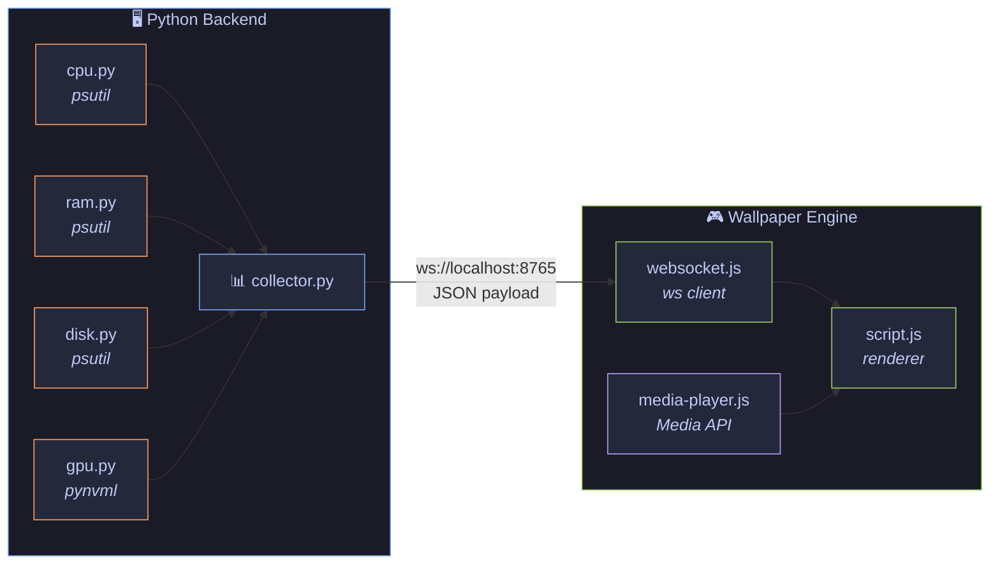

# SinPaper

<p align="center">
  
  
  
</p>

  
  
  

**SinPaper** is a dynamic Wallpaper Engine wallpaper that transforms your desktop into a terminal-style real-time system monitoring panel. Inspired by the Linux/neofetch aesthetic.

A full-screen terminal with an ASCII logo, color-coded CPU/GPU/RAM usage progress bars, world clocks across multiple timezones, countdown timers, a media player, and CRT display effects — all rendered right on your desktop.

---

## Table of Contents

- [How It Works](#how-it-works)
- [Demo](#demo)
- [Features](#features)
- [System Requirements](#system-requirements)
- [Installation](#installation)
  - [Step 1: Clone the Repository](#step-1-clone-the-repository)
  - [Step 2: Install Python Dependencies](#step-2-install-python-dependencies)
  - [Step 3: Start the Backend](#step-3-start-the-backend)
  - [Step 4: Install the Wallpaper in Wallpaper Engine](#step-4-install-the-wallpaper-in-wallpaper-engine)
- [Bootstrapper (Auto-Start)](#bootstrapper-auto-start)
- [Project Structure](#project-structure)
- [Architecture](#architecture)
- [Customization](#customization)
- [Technologies](#technologies)
- [Troubleshooting](#troubleshooting)

---

## How It Works

SinPaper consists of two parts that work together:



1. **Backend** (Python) — runs locally and collects system state data every second: CPU usage, RAM usage, disk usage, GPU load, temperature, and VRAM. Data is sent via WebSocket to `ws://localhost:8765`.

2. **Frontend** (HTML/CSS/JS) — the Wallpaper Engine wallpaper itself, which connects to the backend and renders the received data as a terminal interface with progress bars, clocks, and other information.

The backend is necessary because Wallpaper Engine runs on web technologies (HTML/CSS/JS) and cannot directly access hardware sensors. The Python server bridges this gap by exposing system metrics over a local interface.

---

## Demo

The wallpaper renders as a full-screen terminal with the following sections:

```
llllllllllllllll    llllllllllllllll        sin@sinmirka
llllllllllllllll    llllllllllllllll      
llllllllllllllll    llllllllllllllll      OS:           Windows 11 Pro [64 bits]
llllllllllllllll    llllllllllllllll      Host:         sinmirka
llllllllllllllll    llllllllllllllll      Kernel:       10.0.26200.0
llllllllllllllll    llllllllllllllll      Motherboard:  ASUSTeK COMPUTER INC. PRIME A320M-K
llllllllllllllll    llllllllllllllll      Uptime:       0 hours 0 minutes 13 seconds
                                          Shell:        PowerShell v5.1.100;
llllllllllllllll    llllllllllllllll      Resolution:   1920x1080
llllllllllllllll    llllllllllllllll      Terminal:     Windows Terminal
llllllllllllllll    llllllllllllllll      CPU:          AMD Ryzen 7 5800X 8-Core Processor @ 4.1
llllllllllllllll    llllllllllllllll      GPU:          NVIDIA GeForce RTX 3060 Ti  8.0GB
llllllllllllllll    llllllllllllllll      Memory:       9.9 / 15.9 GiB (62%)
llllllllllllllll    llllllllllllllll      Disk:         341 GiB / 446 GiB (82%)
llllllllllllllll    llllllllllllllll      Websocket:    Connected
  SYSTEM LOAD
    CPU   [==--------------------------------------]    4%
    MEM   [=========================---------------]   62%
    DISK  [=================================-------]   82%
    GPU   [================------------------------]   39%
    VRAM  [==========------------------------------]   24%
GPU TEMP  [48°C]
```

> **Note:** The specific data (CPU model, GPU, etc.) shown above is an example. Your actual system data will be displayed.

---

## Features

- 🖥️ **Real-time system monitoring** — CPU, RAM, disk, GPU usage, temperature, and VRAM
- 🎨 **Terminal aesthetic** — neofetch/Linux style with ASCII-art logo
- 📊 **Color-coded progress bars** — gradient load bars for each component
- 🌍 **World clocks** — clocks in multiple timezones with day progress (default: São Paulo, Paris, Yekaterinburg, Tokyo)
- ⏰ **Countdown timers** — days remaining until events (birthdays, holidays)
- 🎵 **Media player** — displays the current track from Wallpaper Engine Media API with ASCII-art album cover
- 📈 **FPS counter** — shell frame rate monitoring
- 📋 **Event log** — resize, network, and battery logs
- 📺 **CRT effects** — scanlines, noise, and vignetting for an authentic terminal look
- 🔄 **Auto-reconnect** — WebSocket automatically reconnects every 30 seconds on disconnect
- 🚀 **Bootstrapper** — utility to auto-start the backend on Windows login

---

## System Requirements

| Component | Requirement |
|-----------|-------------|
| **OS** | Windows 10/11 |
| **Python** | 3.10 or higher |
| **Wallpaper Engine** | Any current version (available on [Steam](https://store.steampowered.com/app/431960/Wallpaper_Engine/)) |
| **GPU** | NVIDIA GPU (for GPU monitoring; without NVIDIA GPU, GPU features are unavailable, but everything else works fine) |

---

## Installation

### Step 1: Clone the Repository

Open a terminal (PowerShell, CMD, or Git Bash) and run:

```bash
git clone https://github.com/sinmirka/SinWallpaper.git
cd SinWallpaper
```

### Step 2: Install Python Dependencies

Create a virtual environment and install dependencies:

```bash
python -m venv .venv
.venv\Scripts\activate
pip install -r requirements.txt
```

<details>
<summary><b>What gets installed?</b></summary>

| Package | Purpose |
|---------|---------|
| `psutil` | CPU, RAM, and disk monitoring |
| `nvidia-ml-py` | NVIDIA GPU monitoring via NVML |
| `websockets` | WebSocket server for communicating with the wallpaper |

</details>

### Step 3: Start the Backend

Make sure the virtual environment is activated, then start the backend:

```bash
python backend\main.py
```

You should see the message:

```
[WS] Running on ws://localhost:8765
```

> ⚠️ **The backend must be running while you use the wallpaper.** Keep the terminal window open or use the [Bootstrapper](#bootstrapper-auto-start) for automatic startup.

### Step 4: Install the Wallpaper in Wallpaper Engine

1. Open **Wallpaper Engine**
2. Navigate to **My Wallpapers**
3. Click **Create** → **Import**
4. Select the `web\wallpaper.json` file from the cloned repository
5. The wallpaper will appear in the library — select it as your desktop

Alternatively, you can copy the `web/` folder into the Wallpaper Engine wallpapers directory:

```
%AppData%\WallpaperEngine\projects\myprojects\
```

---

## Bootstrapper (Auto-Start)

The Bootstrapper is a utility that automatically starts the backend on Windows login, so you don't have to do it manually every time.

### Usage

```bash
python bootstrapper.py
```

> Administrator privileges are required (the program will request them automatically).

### Menu

```
===== SinPaper Bootstrapper =====
1. Enable Startup     — add the backend to startup (via Windows Task Scheduler)
2. Disable Startup    — remove the backend from startup
3. Exit               — quit
```

### How It Works

The Bootstrapper uses **Windows Task Scheduler** (`schtasks`) to create a task that launches the Python backend when the user logs in. The task uses `pythonw.exe` (no console window) so the process runs in the background.

---

## Project Structure

```
SinWallpaper/
├── bootstrapper.py           # Startup utility (Windows Task Scheduler)
├── requirements.txt          # Python dependencies
│
├── backend/
│   ├── main.py               # WebSocket server (localhost:8765)
│   └── metrics/
│       ├── collector.py      # System metrics aggregator
│       ├── cpu.py            # CPU load monitoring (psutil)
│       ├── ram.py            # RAM usage monitoring (psutil)
│       ├── disk.py           # Disk usage monitoring (psutil)
│       └── gpu.py            # NVIDIA GPU monitoring (pynvml)
│
└── web/                      # Wallpaper Engine wallpaper (frontend)
    ├── wallpaper.json        # Wallpaper Engine metadata
    ├── index.html            # HTML entry point
    ├── style.css             # Styles (CRT effects, terminal)
    ├── script.js             # Main rendering logic
    ├── websocket.js          # WebSocket client with auto-reconnect
    └── media-player.js       # Wallpaper Engine Media API integration
```

---

## Architecture

### Backend

The backend is an async WebSocket server written in Python. Every second it collects metrics and sends a JSON payload to connected clients:

```json
{
  "system": {
    "cpu_usage": 45.2,
    "ram_usage": 62.8,
    "disk": 76.1
  },
  "gpu": {
    "name": "NVIDIA GeForce RTX 3060 Ti",
    "usage": 25,
    "memory_used_mb": 3440,
    "memory_total_mb": 8192,
    "memory_percent": 42,
    "temperature": "[65°C]"
  }
}
```

### Frontend

The frontend consists of three JavaScript modules:

| Module | Role |
|--------|------|
| `websocket.js` | Manages the backend connection. Stores live data in the global `BACKEND_STATE` object. Auto-reconnects on disconnect (30s). |
| `script.js` | Main rendering loop. Collects data from the browser (time, resolution, FPS) and from `BACKEND_STATE`, builds the terminal UI HTML. Renders every second via `requestAnimationFrame`. |
| `media-player.js` | Uses the Wallpaper Engine Media API to display the currently playing track. Converts the album cover to ASCII art. |

### Effects

CSS styles create the atmosphere of an old CRT terminal:

- **Scanlines** — repeating gradient that simulates scan lines
- **Noise** — SVG noise texture at very low opacity
- **Vignette** — radial gradient darkening towards the screen edges
- **Font** — JetBrains Mono (loaded from Google Fonts)

---

## Customization

### System Information

Edit the `CONFIG` object in `web/script.js` to display your computer's specs:

```javascript
const CONFIG = {
  motherboard: 'Your Motherboard',
  cpuModel:    'Your CPU',
  cpuFreq:     '@ 4.1',
  gpuModel:    'Your GPU',
  gpuMem:      '8GB',
  osName:      'Windows 11 Pro',
  kernel:      '10.0.26200.0',
  hostname:    'your-pc-name',
  memTotalGiB: 16,    // Total RAM in GiB
  diskTotalGiB: 500,  // Total disk space in GiB
  diskUsedGiB:  300,  // Used disk space in GiB
  barLen:       40,   // Progress bar length
};
```

### World Clocks

Change the list of timezones in `web/script.js`:

```javascript
const CLOCKS = [
  { label: 'LONDON',    timezone: 'Europe/London'        },
  { label: 'TOKYO',     timezone: 'Asia/Tokyo'           },
  { label: 'NEW YORK',  timezone: 'America/New_York'     },
];
```

### Countdown Timers

Configure events in `web/script.js`:

```javascript
const COUNTDOWNS = [
  { label: 'Birthday',  month: 5, day: 15, hour: 0 },  // month: 0 = January
  { label: 'New Year',  month: 0, day: 1,  hour: 0 },
];
```

### WebSocket Port

The server runs on port `8765` by default. To change it:

1. In `backend/main.py`, change the `8765` argument in `websockets.serve()`
2. In `web/websocket.js`, update the URL in `new WebSocket('ws://localhost:8765')`

---

## Technologies

### Backend

| Technology | Purpose |
|-----------|---------|
| [Python](https://python.org) | Primary backend language |
| [asyncio](https://docs.python.org/3/library/asyncio.html) | Async event loop |
| [websockets](https://websockets.readthedocs.io/) | WebSocket server |
| [psutil](https://psutil.readthedocs.io/) | CPU, RAM, and disk monitoring |
| [nvidia-ml-py](https://pypi.org/project/nvidia-ml-py/) | NVIDIA GPU monitoring via NVML |

### Frontend

| Technology | Purpose |
|-----------|---------|
| HTML5 | Page structure |
| CSS3 | CRT effects, terminal styling |
| JavaScript (ES6+) | Rendering logic, WebSocket, UI |
| [JetBrains Mono](https://www.jetbrains.com/lp/mono/) | Monospace font |
| [Wallpaper Engine API](https://docs.wallpaperengine.io/) | Wallpaper Engine integration (media player) |

---

## Troubleshooting

<details>
<summary><b>Backend won't start / "ModuleNotFoundError"</b></summary>

Make sure you activated the virtual environment before running:

```bash
.venv\Scripts\activate
pip install -r requirements.txt
python backend\main.py
```

</details>

<details>
<summary><b>GPU metrics not showing</b></summary>

GPU monitoring is only available for NVIDIA GPUs with the NVIDIA driver installed. If you have an AMD or Intel GPU, the GPU section in the wallpaper will display dashes, but all other metrics (CPU, RAM, disk) will work normally.

</details>

<details>
<summary><b>Wallpaper not connecting to the backend</b></summary>

1. Make sure the backend is running — you should see `[WS] Running on ws://localhost:8765` in the terminal
2. Verify that Wallpaper Engine is using the Chromium engine (Settings → General)
3. Check the WebSocket status at the bottom of the wallpaper — it should say `Connected`
4. If the status shows `Reconnecting in Xs...` — wait 30 seconds for automatic reconnection

</details>

<details>
<summary><b>Bootstrapper requires administrator privileges</b></summary>

This is expected — Windows Task Scheduler requires elevated privileges. The program will automatically request UAC confirmation.

</details>

<details>
<summary><b>Wallpaper shows "Media API not available"</b></summary>

This means the Wallpaper Engine Media API is unavailable. Make sure that:
- A music player is running and playing music
- Wallpaper Engine has access to the Media API (enabled in settings)

</details>

---

## License

This is an open-source project. See the repository for details.