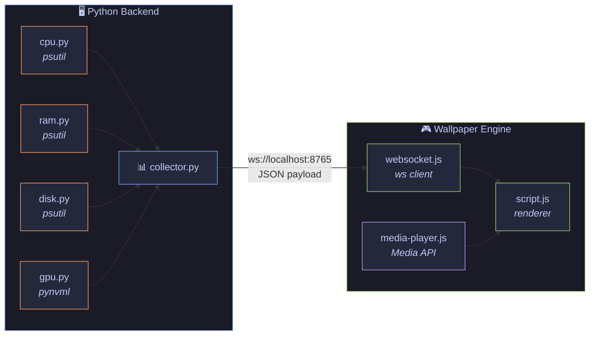

# SinPaper

<p align="center">
  <a href="README.md">🇬🇧 English</a> · 🇷🇺 Русский
</p>

<p align="center">
  
  
  
</p>

<p align="center">
  
  
  
</p>

**SinPaper** — это динамический Wallpaper Engine обои, которые превращают ваш рабочий стол в терминал-стиль панель мониторинга системы в реальном времени. Вдохновлено эстетикой Linux/neofetch.

Полноэкранный терминал с ASCII-логотипом, цветными прогресс-барами загрузки CPU/GPU/RAM, часами в разных часовых поясах, таймерами обратного отсчёта, медиаплеером и эффектами CRT-дисплея — всё это прямо на вашем рабочем столе.

---

## Содержание

- [Как это работает](#как-это-работает)
- [Демонстрация](#демонстрация)
- [Возможности](#возможности)
- [Системные требования](#системные-требования)
- [Установка](#установка)
  - [Шаг 1: Клонирование репозитория](#шаг-1-клонирование-репозитория)
  - [Шаг 2: Установка Python зависимостей](#шаг-2-установка-python-зависимостей)
  - [Шаг 3: Запуск бэкенда](#шаг-3-запуск-бэкенда)
  - [Шаг 4: Установка обоев в Wallpaper Engine](#шаг-4-установка-обоев-в-wallpaper-engine)
- [Bootstrapper (автозапуск)](#bootstrapper-автозапуск)
- [Структура проекта](#структура-проекта)
- [Архитектура](#архитектура)
- [Настройка под себя](#настройка-под-себя)
- [Технологии](#технологии)
- [Устранение неполадок](#устранение-неполадок)

---

## Как это работает

SinPaper состоит из двух частей, которые работают вместе:



1. **Бэкенд** (Python) — запускается локально и каждую секунду собирает данные о состоянии системы: загрузку CPU, объём используемой RAM, занятое место на диске, загрузку GPU, температуру и объём видеопамяти. Данные отправляются через WebSocket на `ws://localhost:8765`.

2. **Фронтенд** (HTML/CSS/JS) — это сами Wallpaper Engine обои, которые подключаются к бэкенду и отображают полученные данные в виде терминального интерфейса с прогресс-барами, часами и другой информацией.

Бэкенд необходим потому, что Wallpaper Engine работает на веб-технологиях (HTML/CSS/JS) и не может напрямую обращаться к аппаратным датчикам. Python-сервер решает эту проблему, предоставляя данные через локальный интерфейс.

---

## Демонстрация

Обои выглядят как полноэкранный терминал со следующими секциями:

```
llllllllllllllll    llllllllllllllll        sin@sinmirka
llllllllllllllll    llllllllllllllll      
llllllllllllllll    llllllllllllllll      OS:           Windows 11 Pro [64 bits]
llllllllllllllll    llllllllllllllll      Host:         sinmirka
llllllllllllllll    llllllllllllllll      Kernel:       10.0.26200.0
llllllllllllllll    llllllllllllllll      Motherboard:  ASUSTeK COMPUTER INC. PRIME A320M-K
llllllllllllllll    llllllllllllllll      Uptime:       0 hours 0 minutes 13 seconds
                                          Shell:        PowerShell v5.1.100;
llllllllllllllll    llllllllllllllll      Resolution:   1920x1080
llllllllllllllll    llllllllllllllll      Terminal:     Windows Terminal
llllllllllllllll    llllllllllllllll      CPU:          AMD Ryzen 7 5800X 8-Core Processor @ 4.1
llllllllllllllll    llllllllllllllll      GPU:          NVIDIA GeForce RTX 3060 Ti  8.0GB
llllllllllllllll    llllllllllllllll      Memory:       9.9 / 15.9 GiB (62%)
llllllllllllllll    llllllllllllllll      Disk:         341 GiB / 446 GiB (82%)
llllllllllllllll    llllllllllllllll      Websocket:    Connected
  SYSTEM LOAD
    CPU   [==--------------------------------------]    4%
    MEM   [=========================---------------]   62%
    DISK  [=================================-------]   82%
    GPU   [================------------------------]   39%
    VRAM  [==========------------------------------]   24%
GPU TEMP  [48°C]
```

> **Примечание:** Конкретные данные (модель CPU, GPU и т.д.) на скриншоте выше — это пример. У вас будут отображаться реальные данные вашего компьютера.

---

## Возможности

- 🖥️ **Мониторинг системы в реальном времени** — CPU, RAM, диск, загрузка GPU, температура и VRAM
- 🎨 **Терминальная эстетика** — стиль neofetch/Linux с ASCII-арт логотипом
- 📊 **Цветные прогресс-бары** — градиентные полосы загрузки для каждого компонента
- 🌍 **Мировые часы** — часы в нескольких часовых поясах с прогрессом дня (по умолчанию: Сан-Паулу, Париж, Екатеринбург, Токио)
- ⏰ **Таймеры обратного отсчёта** — дни до событий (дни рождения, праздники)
- 🎵 **Медиаплеер** — отображает текущий трек из Wallpaper Engine Media API с ASCII-арт обложкой альбома
- 📈 **FPS-счётчик** — мониторинг частоты кадров оболочки
- 📋 **Журнал событий** — логи resize, сети, батареи
- 📺 **Эффекты CRT** — сканлайны, шум, виньетирование для аутентичного терминального вида
- 🔄 **Авто-переподключение** — WebSocket автоматически переподключается каждые 30 секунд при обрыве
- 🚀 **Bootstrapper** — утилита для автоматического запуска бэкенда при входе в Windows

---

## Системные требования

| Компонент | Требование |
|-----------|-----------|
| **ОС** | Windows 10/11 |
| **Python** | 3.10 или выше |
| **Wallpaper Engine** | Любая актуальная версия (доступна в [Steam](https://store.steampowered.com/app/431560/Wallpaper_Engine/)) |
| **GPU** | NVIDIA GPU (для мониторинга GPU; без NVIDIA GPU функции GPU недоступны, но всё остальное работает) |

---

## Установка

### Шаг 1: Клонирование репозитория

Откройте терминал (PowerShell, CMD или Git Bash) и выполните:

```bash
git clone https://github.com/sinmirka/SinWallpaper.git
cd SinWallpaper
```

### Шаг 2: Установка Python зависимостей

Создайте виртуальное окружение и установите зависимости:

```bash
python -m venv .venv
.venv\Scripts\activate
pip install -r requirements.txt
```

<details>
<summary><b>Что устанавливается?</b></summary>

| Пакет | Назначение |
|-------|-----------|
| `psutil` | Мониторинг CPU, RAM и диска |
| `nvidia-ml-py` | Мониторинг NVIDIA GPU через NVML |
| `websockets` | WebSocket-сервер для связи с обоями |

</details>

### Шаг 3: Запуск бэкенда

Убедитесь, что виртуальное окружение активировано, и запустите бэкенд:

```bash
python backend\main.py
```

Вы должны увидеть сообщение:

```
[WS] Running on ws://localhost:8765
```

> ⚠️ **Бэкенд должен работать, пока вы используете обои.** Оставьте окно терминала открытым или используйте [Bootstrapper](#bootstrapper-автозапуск) для автоматического запуска.

### Шаг 4: Установка обоев в Wallpaper Engine

1. Откройте **Wallpaper Engine**
2. Перейдите в **Мои обои**
3. Нажмите **Создать** → **Импорт**
4. Выберите файл `web\wallpaper.json` из клонированного репозитория
5. Обои появятся в библиотеке — выберите их как рабочий стол

Альтернативно, вы можете скопировать папку `web/` в папку с обоями Wallpaper Engine:

```
%AppData%\WallpaperEngine\projects\myprojects\
```

---

## Bootstrapper (автозапуск)

Bootstrapper — это утилита, которая автоматически запускает бэкенд при входе в Windows, чтобы вам не приходилось делать это вручную каждый раз.

### Запуск

```bash
python bootstrapper.py
```

> Требуются права администратора (программа запросит их автоматически).

### Меню

```
===== SinPaper Bootstrapper =====
1. Enable Startup     — добавить бэкенд в автозапуск (через Планировщик заданий Windows)
2. Disable Startup    — убрать бэкенд из автозапуска
3. Exit               — выйти
```

### Как это работает

Bootstrapper использует **Планировщик заданий Windows** (`schtasks`) для создания задачи, которая запускает Python-бэкенд при входе пользователя в систему. Задача использует `pythonw.exe` (без окна консоли), чтобы процесс работал в фоновом режиме.

---

## Структура проекта

```
SinWallpaper/
├── bootstrapper.py           # Утилита автозапуска (Windows Task Scheduler)
├── requirements.txt          # Python зависимости
│
├── backend/
│   ├── main.py               # WebSocket-сервер (localhost:8765)
│   └── metrics/
│       ├── collector.py      # Агрегатор системных метрик
│       ├── cpu.py            # Мониторинг загрузки CPU (psutil)
│       ├── ram.py            # Мониторинг использования RAM (psutil)
│       ├── disk.py           # Мониторинг использования диска (psutil)
│       └── gpu.py            # Мониторинг NVIDIA GPU (pynvml)
│
└── web/                      # Wallpaper Engine обои (фронтенд)
    ├── wallpaper.json        # Метаданные Wallpaper Engine
    ├── index.html            # Точка входа HTML
    ├── style.css             # Стили (CRT-эффекты, терминал)
    ├── script.js             # Основная логика отображения
    ├── websocket.js          # WebSocket-клиент с авто-переподключением
    └── media-player.js       # Интеграция с Media API Wallpaper Engine
```

---

## Архитектура

### Бэкенд

Бэкенд — это асинхронный WebSocket-сервер на Python. Каждую секунду он собирает метрики и отправляет JSON-платёж подключённым клиентам:

```json
{
  "system": {
    "cpu_usage": 45.2,
    "ram_usage": 62.8,
    "disk": 76.1
  },
  "gpu": {
    "name": "NVIDIA GeForce RTX 3060 Ti",
    "usage": 25,
    "memory_used_mb": 3440,
    "memory_total_mb": 8192,
    "memory_percent": 42,
    "temperature": "[65°C]"
  }
}
```

### Фронтенд

Фронтенд состоит из трёх JavaScript-модулей:

| Модуль | Роль |
|--------|------|
| `websocket.js` | Управляет подключением к бэкенду. Хранит актуальные данные в глобальном объекте `BACKEND_STATE`. Автоматически переподключается при обрыве (30 сек). |
| `script.js` | Основной цикл отрисовки. Собирает данные из браузера (время, разрешение, FPS) и из `BACKEND_STATE`, формирует HTML терминального интерфейса. Рендеринг каждую секунду через `requestAnimationFrame`. |
| `media-player.js` | Использует Wallpaper Engine Media API для отображения текущего трека. Конвертирует обложку альбома в ASCII-арт. |

### Эффекты

CSS-стили создают атмосферу старого CRT-терминала:

- **Сканлайны** — повторяющийся градиент, имитирующий строки развёртки
- **Шум** — SVG-текстура шума с очень низкой прозрачностью
- **Виньетка** — радиальный градиент затемнения по краям экрана
- **Шрифт** — JetBrains Mono (загружается из Google Fonts)

---

## Настройка под себя

### Системная информация

Отредактируйте объект `CONFIG` в файле `web/script.js` для отображения данных вашего компьютера:

```javascript
const CONFIG = {
  motherboard: 'Ваша материнская плата',
  cpuModel:    'Ваш процессор',
  cpuFreq:     '@ 4.1',
  gpuModel:    'Ваша видеокарта',
  gpuMem:      '8GB',
  osName:      'Windows 11 Pro',
  kernel:      '10.0.26200.0',
  hostname:    'ваше-имя-компьютера',
  memTotalGiB: 16,    // Общий объём RAM в ГиБ
  diskTotalGiB: 500,  // Общий объём диска в ГиБ
  diskUsedGiB:  300,  // Используемое место на диске в ГиБ
  barLen:       40,   // Длина прогресс-баров
};
```

### Мировые часы

Измените список часовых поясов в `web/script.js`:

```javascript
const CLOCKS = [
  { label: 'LONDON',    timezone: 'Europe/London'        },
  { label: 'TOKYO',     timezone: 'Asia/Tokyo'           },
  { label: 'NEW YORK',  timezone: 'America/New_York'     },
];
```

### Таймеры обратного отсчёта

Настройте события в `web/script.js`:

```javascript
const COUNTDOWNS = [
  { label: 'Birthday',  month: 5, day: 15, hour: 0 },  // month: 0 = January
  { label: 'New Year',  month: 0, day: 1,  hour: 0 },
];
```

### WebSocket порт

По умолчанию сервер работает на порту `8765`. Чтобы изменить его:

1. В `backend/main.py` измените аргумент `8765` в `websockets.serve()`
2. В `web/websocket.js` измените URL в `new WebSocket('ws://localhost:8765')`

---

## Технологии

### Бэкенд

| Технология | Назначение |
|-----------|-----------|
| [Python](https://python.org) | Основной язык бэкенда |
| [asyncio](https://docs.python.org/3/library/asyncio.html) | Асинхронный event loop |
| [websockets](https://websockets.readthedocs.io/) | WebSocket-сервер |
| [psutil](https://psutil.readthedocs.io/) | Мониторинг CPU, RAM и диска |
| [nvidia-ml-py](https://pypi.org/project/nvidia-ml-py/) | Мониторинг NVIDIA GPU через NVML |

### Фронтенд

| Технология | Назначение |
|-----------|-----------|
| HTML5 | Структура страницы |
| CSS3 | CRT-эффекты, терминальные стили |
| JavaScript (ES6+) | Логика отрисовки, WebSocket, рендеринг |
| [JetBrains Mono](https://www.jetbrains.com/lp/mono/) | Моноширинный шрифт |
| [Wallpaper Engine API](https://docs.wallpaperengine.io/) | Интеграция с Wallpaper Engine (медиаплеер) |

---

## Устранение неполадок

<details>
<summary><b>Бэкенд не запускается / ошибка "ModuleNotFoundError"</b></summary>

Убедитесь, что вы активировали виртуальное окружение перед запуском:

```bash
.venv\Scripts\activate
pip install -r requirements.txt
python backend\main.py
```

</details>

<details>
<summary><b>GPU-метрики не отображаются</b></summary>

GPU-мониторинг доступен только для видеокарт NVIDIA с установленным драйвером NVIDIA. Если у вас AMD или Intel GPU, секция GPU в обоях будет отображать прочерки, но остальные метрики (CPU, RAM, диск) будут работать нормально.

</details>

<details>
<summary><b>Обои не подключаются к бэкенду</b></summary>

1. Убедитесь, что бэкенд запущен — в терминале должно быть сообщение `[WS] Running on ws://localhost:8765`
2. Проверьте, что Wallpaper Engine использует Chromium-движок (Настройки → Общие)
3. Посмотрите на статус WebSocket в нижней части обоев — должно быть `Connected`
4. Если статус `Reconnecting in Xs...` — подождите 30 секунд для автоматического переподключения

</details>

<details>
<summary><b>Bootstrapper требует права администратора</b></summary>

Это нормально — Планировщик заданий Windows требует повышения привилегий. Программа автоматически запросит подтверждение UAC.

</details>

<details>
<summary><b>Обои показывают "Media API not available"</b></summary>

Это значит, что Wallpaper Engine Media API недоступен. Убедитесь, что:
- Музыкальный плеер запущен и воспроизводит музыку
- Wallpaper Engine имеет доступ к Media API (включено в настройках)

</details>

---

## Лицензия

Этот проект является открытым. См. репозиторий для подробностей.